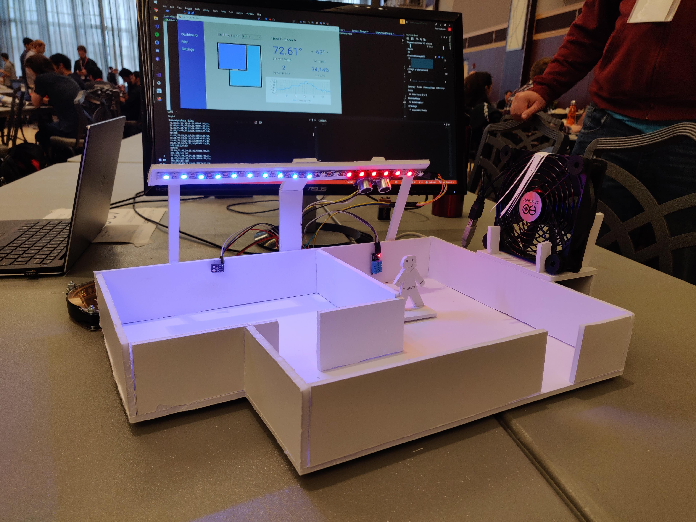
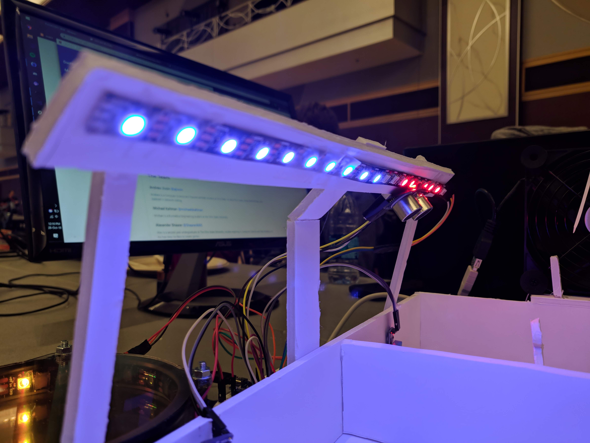
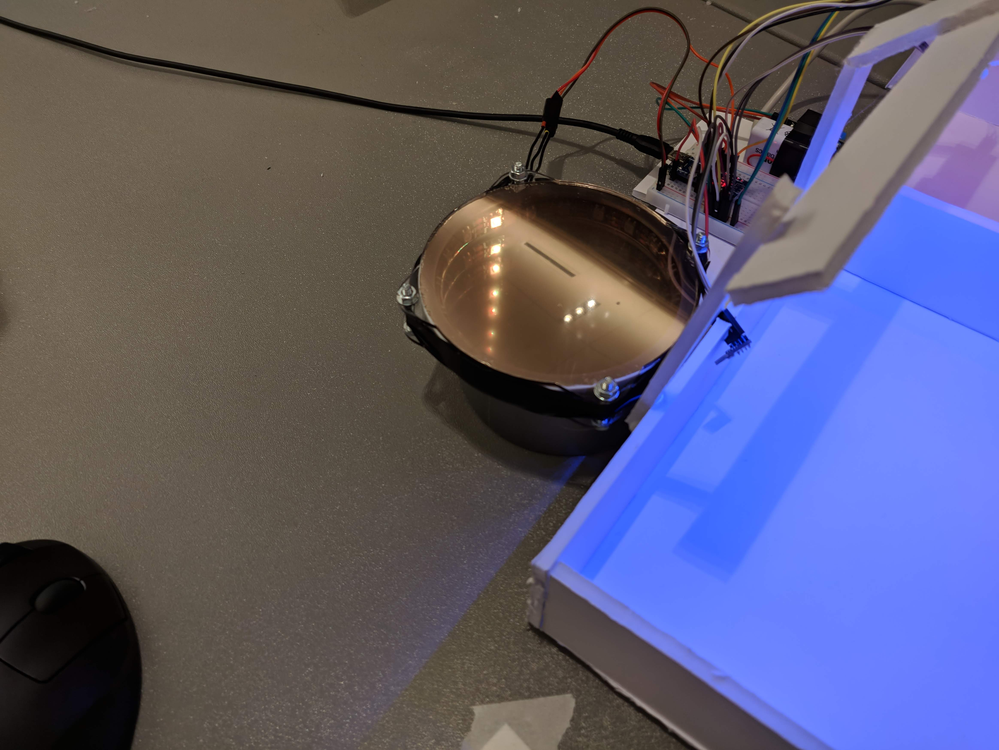
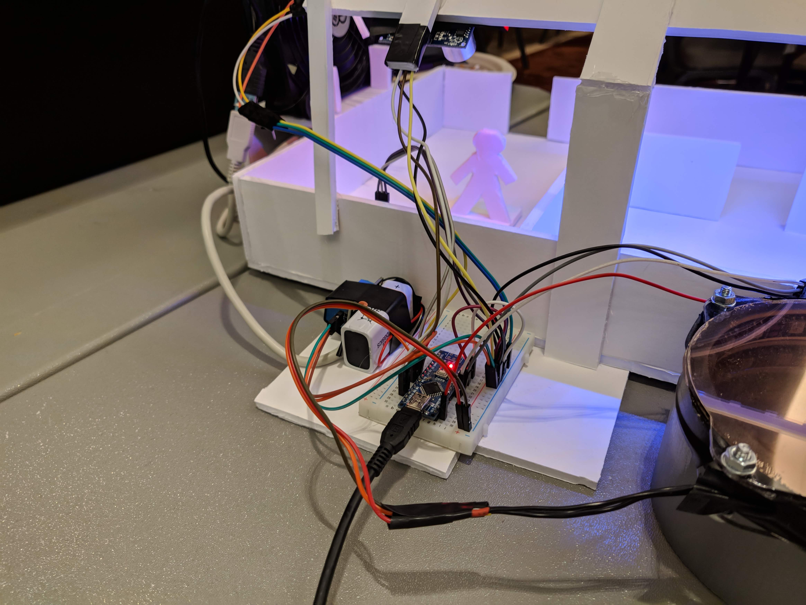
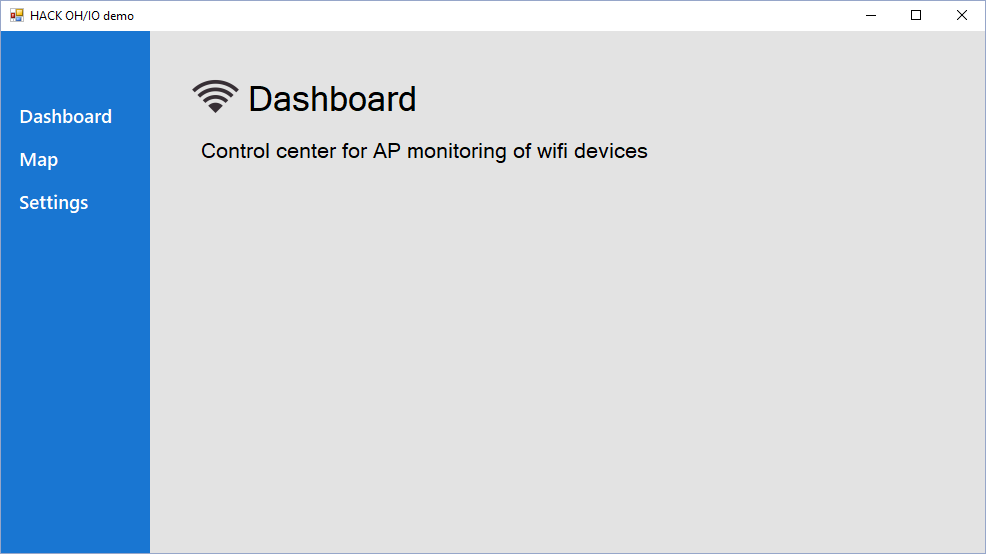
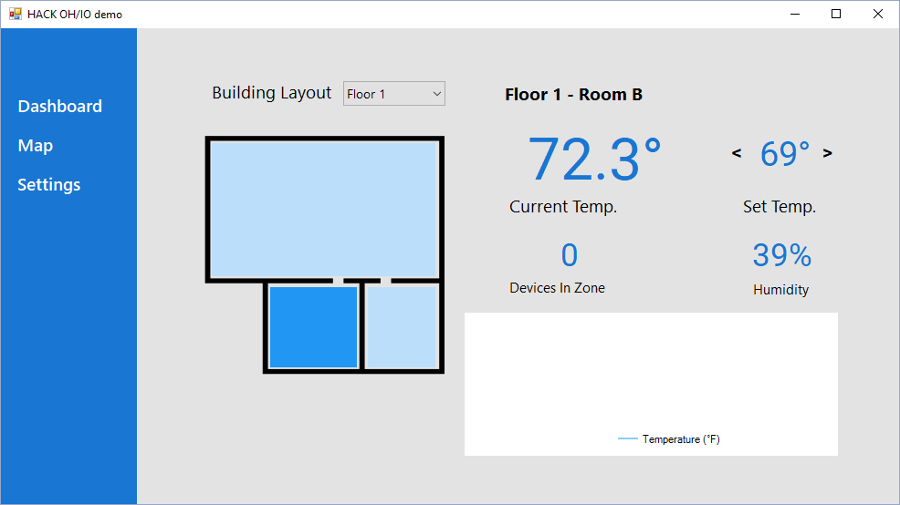
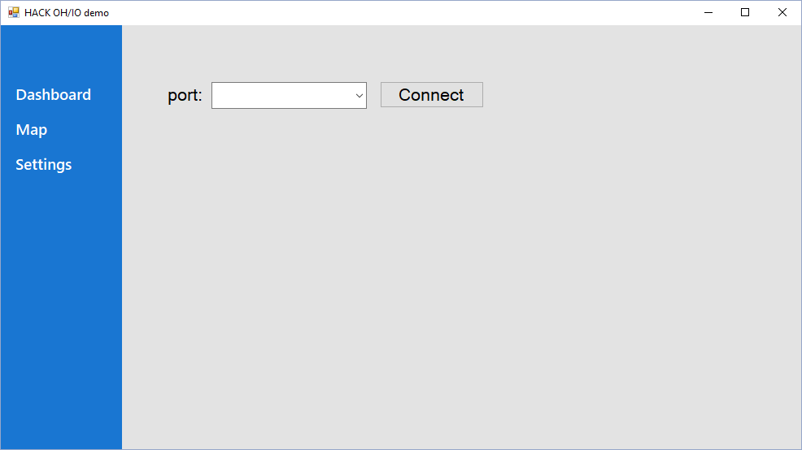

Large businesses and universities have WiFi access points everywhere. Can these be utilized to more intelligently turn on air conditioning and heating, leading to vast energy savings?

At [HACK OHI/O 2018](http://hack.osu.edu/2018/), we put together an application and physical model to showcase our answer to this question.

Our goal was to take advantage of vast wireless internet networks to create a smarter climate control solution. We accomplished this by combining network connection data of access points with temperature and proximity readings.

## The Team

**[Alex Shearer](https://sheareraws.com/)** — Alex is a second-year undergraduate at The Ohio State University, double-majoring in Computer Science and Data Analytics. In his free time, he likes to create games.

**[Andrew Jivoin](https://jivoin.com/)** — Andrew is studying Computer Science and Theoretical Math at Ohio State. He drew floor plans, wrote README files, and did in-network coding on this project.

**[Jon Zimmerman](https://github.com/Jon-Zimmerman)** — Jon Zimmerman is a Mechanical Engineering student at Ohio State. Fun fact: he is a hardware hacking professional and hates being written about in README files.

**[Michael Kaltman](https://github.com/michaelskaltman)** — Michael is a Biomedical Engineering student at The Ohio State University.

## What we built

Over the course of 24 hours, we developed a C# WinForms application and a physical demo of our idea.

### Physical model

#### Left room

The room on the left contains a temperature sensor and lights to show if it is being cooled, heated, or neither. If devices are connected to the network in the room and its temperature rises above or below the desired temperature, the room is cooled or heated. When cooled or heated the blue or red LEDs turn on, respectively.

#### Right room

The room on the right contains temperature and ultrasonic sensors. Heating or cooling engage in this room only if someone is detected by the ultrasonic sensor. This room showcases a way to detect people when they don't have a wireless-enabled device (a shocking idea in 2018). It wouldn't make sense to turn the heat off just because your phone is in another part of the building.

The fan in this room turns on if the room is in a cooling state.

#### Lights

The model has two distinct lighting features.

The most significant is the temperature LEDs. These show whether a room is cooling or heating, and update dynamically based on the user's requested temperature.

The other lighting was the status LEDs for the number of devices connected. This was created with a re-purposed infinity mirror. Its purpose was to show that network data could be passed along to the Arduino. Each LED lit in the ring represents one device connected.

### Arduino and sensors

An Arduino Nano was used to control the lighting and read the sensors. The Arduino read input from two environmental sensors and an ultrasonic sensor. Additionally it controlled the two lighting arrangements and the fan.

## Software

### Dashboard

The dashboard is a C# WinForms application. It has three main components.

#### Homescreen

#### Map

This screen shows a floor plan and each of its zones. Each zone can be individually monitored and controlled. Multiple floor plans can be added and selected.

#### Settings

Currently this screen only serves to select the port the Arduino is connected to. Other settings and preferences may be placed here in the future, such as network settings.

### Network Scanner

The Network Scanner class was our way of detecting how many devices were on the network. It has the ability to asynchronously scan for other connections within an IP range or specific IPs. To avoid abuse, this class will only attempt to ping devices on the same network.

This information was passed along to the WinForms application and the Arduino. In the WinForms application the number of devices connected to each zone was displayed. The Arduino enabled one light on the LED ring for each connected device.

The source code for the Network Scanner is visible in the [GitHub repo](https://github.com/ajivoin/heck-ohio).

## Video

	<iframe
		class="h-full w-full"
		src="https://www.youtube-nocookie.com/embed/-znSfmmXR-8"
		title="Intelligent Climate Control demo video"
		frameborder="0"
		allow="autoplay; encrypted-media"
		allowfullscreen
	></iframe>

